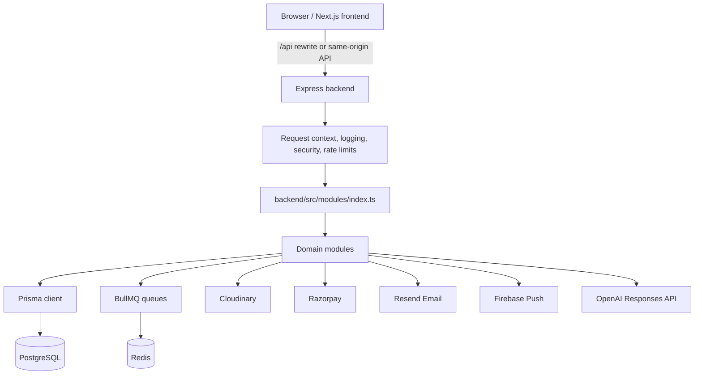
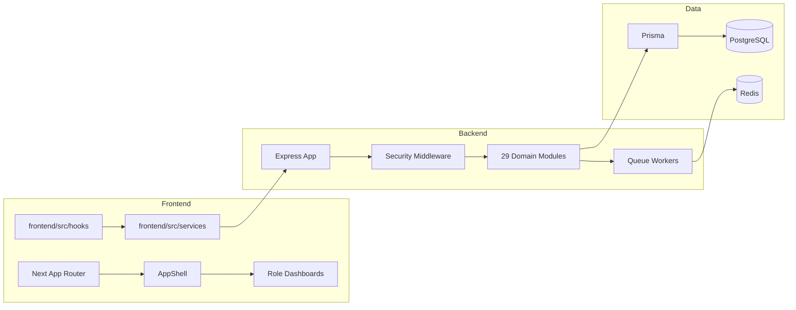

# 02 - System Inventory

## Repository Type

Confirmed monorepo:

- Root: `package.json`
- Workspaces: `frontend`, `backend`
- Root scripts coordinate frontend/backend build, dev, production checks, migrations, and readiness tests.

## Technology Stack

Frontend:

- Next.js app router in `frontend/src/app`
- React latest
- TypeScript strict mode
- React Query
- Axios API client
- Framer Motion
- Recharts
- Lucide icons
- Playwright E2E
- Sentry browser instrumentation

Backend:

- Express API in `backend/src/app.ts`
- TypeScript ESM
- Prisma with PostgreSQL adapter
- PostgreSQL database
- Redis and BullMQ queues
- Cloudinary media storage
- Razorpay payments
- Resend/Nodemailer email
- Firebase Admin push notifications
- Sentry backend monitoring
- Helmet, CORS, compression, Morgan, pino logging
- express-rate-limit equivalent custom Redis/local fallback middleware
- Swagger docs in development/production API surface

## Root Scripts

Root `package.json` confirms:

- `npm run dev` uses `scripts/dev.mjs`
- `npm run build` runs backend then frontend builds
- `npm run test:public-beta` validates Prisma, frontend lint, backend/frontend build, auth, infra, CBT, payments, AI, and ops scripts
- Production scripts exist for env validation, bootstrap, DB readiness, queue readiness, integration readiness, security readiness, and Prisma migrate deploy

## Runtime Flow

## Backend Entry Points

- `backend/src/server.ts` starts the backend and workers depending on `PROCESS_ROLE`.
- `backend/src/app.ts` creates Express app, security middleware, JSON parsing, health handling, Swagger, maintenance mode, API routing, and error handling.
- `backend/src/modules/index.ts` mounts all API routes under `/api`.

## Frontend Entry Points

- `frontend/src/app/page.tsx` renders `/`.
- `frontend/src/app/**/page.tsx` defines public, dashboard, module, and utility routes.
- `frontend/src/components/layout/app-shell.tsx` determines public shell vs dashboard shell and bypasses chrome for `/`.
- `frontend/src/services/api.ts` creates the Axios client.
- `frontend/src/components/providers/auth-provider-v2.tsx` manages current user state.

## Deployment and Ops Files

Confirmed:

- `Dockerfile`
- `frontend/Dockerfile`
- `backend/Dockerfile`
- `railway.json`
- `DEPLOYMENT.md`
- `PRODUCTION_CHECKLIST.md`
- `PRODUCTION_GO_LIVE.md`
- `docs/RAILWAY_SETUP.md`
- `docs/BACKUP_RECOVERY.md`
- `docs/OPERATIONAL_HANDBOOK.md`

## Local Setup

README describes:

1. `npm install`
2. copy backend/frontend env examples
3. run Prisma migration deploy
4. run backend and frontend dev servers

Assessment: local setup is **possible with effort**. It depends on PostgreSQL and production-like env values. Some README variable names mention older providers such as Brevo while current code uses Resend, so docs need alignment.

## Environment Variables

Backend env schema in `backend/src/config/env.ts` validates:

- `DATABASE_URL`
- `JWT_SECRET`
- `PORT`
- `CORS_ORIGIN`
- `FRONTEND_APP_URL`
- `BACKEND_PUBLIC_URL`
- `APP_DOMAIN`
- `API_DOMAIN`
- auth timeouts and lock settings
- `REDIS_URL`, `REDIS_REQUIRED`
- queue settings
- Sentry settings
- Firebase settings
- upload size
- AI timeout and queue settings
- maintenance mode
- Razorpay keys
- Resend key/from email
- OpenAI key
- Cloudinary keys
- sales booster Meta, Instagram, Threads, YouTube, WhatsApp settings

No secret values are included in this audit.

## Current Architecture Diagram

