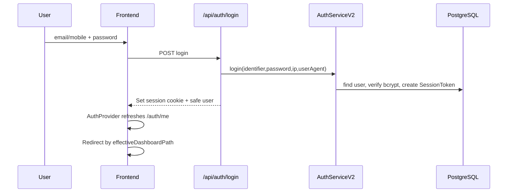

# 04 - Role Permission Matrix

## Confirmed Role Enum

The Prisma schema defines a `Role` enum in `backend/prisma/schema.prisma`. Frontend auth types confirm these roles:

- `ADMIN`
- `GUEST`
- `STUDENT`
- `PARENT`
- `TEACHER`
- `ACADEMIC_HEAD`
- `PHYSICAL_TRAINER`
- `ADMINISTRATIVE_OFFICER`
- `BUSINESS_DEVELOPMENT_EXECUTIVE`
- `DIRECTOR`
- `TELECALLER`
- `MARKETING_COORDINATOR`

Additional dashboard-template behavior is carried in `User.roleMetadata.dashboardTemplate`, including values such as:

- `VIDEO_EDITOR`
- `ACADEMIC_HEAD`
- `ADMISSION_CELL`
- `MARKETING`
- `SALES_BOOSTER`
- `ACCOUNTS`
- `ACCOUNTANT`
- `FINANCE`

## Authentication Flow

## Authorization Layers

| Layer | Evidence | Description |
|---|---|---|
| Session cookie | `SessionToken` model, `AuthServiceV2.verify` | Authenticated API requests rely on session id cookie. |
| Role enum checks | `allowRoles`, `requireRole` | Most backend modules use route-level role checks. |
| Dashboard template | `roleMetadata.dashboardTemplate` | Used to adapt dashboards for staff with broad role but limited operational desk. |
| Admin permission matrix | `AdminRole`, `Permission`, `RolePermission`, `UserRole` | Used primarily in admin center through `requirePermission`. |
| Frontend route guard | `DashboardFetchGuard`, `canAccessDashboardPath` | Client redirects users away from dashboard paths outside their role. |

## Role Workspace Matrix

| Role/workspace | Main frontend path | Main backend access |
|---|---|---|
| Director | `/dashboard/director` | Academy, CRM, payments, admin, reports, dashboard |
| Admin | `/admin-center/operations` or director fallback | Admin center, users, settings, operations |
| Academic Head | `/dashboard/academic-head` | Academy academic roles, teacher/class APIs |
| Teacher | `/dashboard/teacher` | Academy teacher APIs, tests, exams, materials |
| Student | `/dashboard/student` | Courses, tests, learning, attendance, fees self-scope |
| Parent | `/dashboard/parent` | Parent-linked student data, fees, messages |
| Admission Cell | `/dashboard/admission-cell` | CRM lead/admission routes, limited academy admission approval support |
| Business Development | `/dashboard/business-development` | CRM/sales booster |
| Telecaller | `/dashboard/business-development` | CRM/sales booster-style flows |
| Marketing Coordinator | `/dashboard/business-development` | CRM/sales booster/communications |
| Physical Trainer | `/dashboard/teacher` or `/fitness` | Fitness and academy physical roles |
| Video Editor | `/dashboard/video-editor` | Limited academy media/study material operations |
| Guest | `/dashboard/guest` | Guest application and assessment surfaces |

## RBAC Observations

Strengths:

- Backend route middleware is present and widely used.
- Session verification checks expiration and disabled users.
- Admin-center permissions use a role/permission matrix and audit events.
- Dashboard guard redirects users to the correct dashboard.
- Public lead routes are separated from authenticated CRM routes.

Risks:

- Authorization is not one uniform policy engine. It combines enum roles, templates, frontend guards, and admin permission tables.
- Frontend route guard is helpful UX but not security; backend object-level checks must be verified endpoint by endpoint.
- `requireInstituteScope` currently documents single-institute mode and does not enforce tenant isolation.
- Directors and admins often have broad access; branch restrictions exist in some services but need full audit.
- Permission models exist but are not applied across all modules.

## Recommended Decision

Do not replace RBAC immediately. Preserve the current role model, then progressively introduce a single permission evaluation library that can answer:

- Can this actor access this route?
- Can this actor access this specific object?
- Can this actor perform this action in this branch/institute?
- Should this action be audited?

