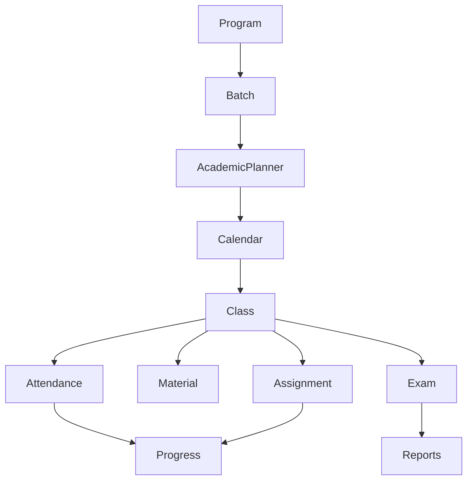
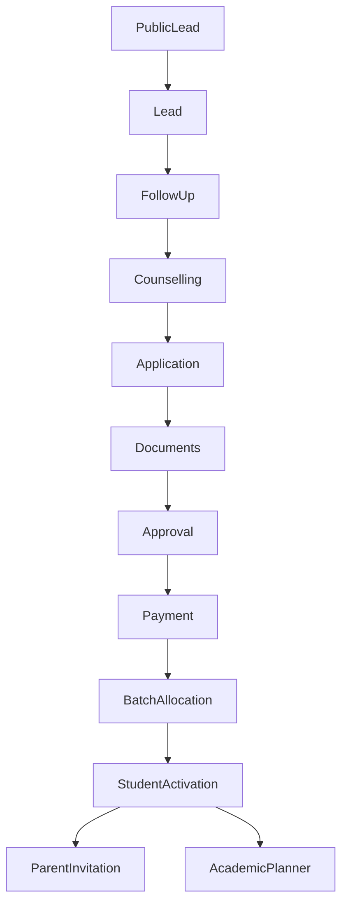
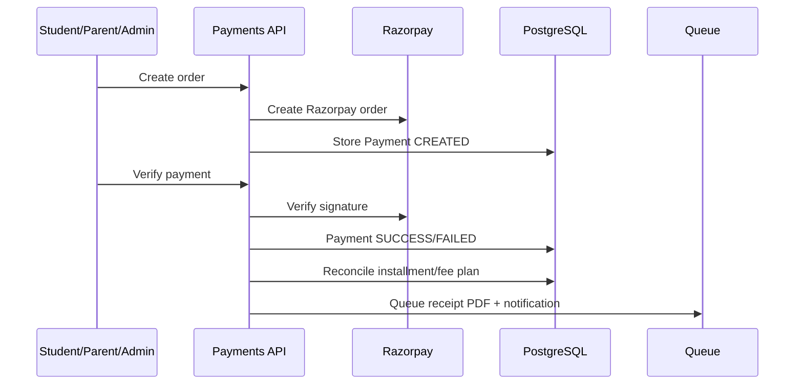

# 06 - Workflow Audit

## Current Workflow Architecture

Workflows exist, but they are mostly embedded inside services and pages rather than governed by one workflow engine.

Confirmed workflow carriers:

- `backend/src/modules/academy/academy.service.ts`
- `backend/src/modules/crm/crm.service.ts`
- `backend/src/modules/payments/payments.service.ts`
- `backend/src/modules/communication/communication.service.ts`
- `backend/src/modules/ai-workflow`
- `backend/src/queues`
- `AuditLog`
- `QueueJobLog`
- module-specific status fields

## Academic Workflow

Target operating flow:

Program -> Batch -> Subject -> Chapter -> Topic -> Lesson -> Class Schedule -> Class Completed -> Attendance -> Material -> Assignment -> Quiz -> Test -> Performance.

Confirmed pieces:

- Program/course/batch models exist.
- Batch planner data exists via batch `schedule`/academic planner usage.
- Academic calendar routes exist under `/api/academy/academic-calendar`.
- Attendance routes exist.
- Assignment routes exist.
- Study material routes exist.
- Exam draft/publish routes exist.
- Teacher performance and syllabus progress summaries exist.

Current weakness:

- The workflow is not yet one explicitly enforced state machine.
- Planner, timetable, classes, attendance, material, assignments, and exams can be reached from different surfaces.

## Admissions Workflow

Target flow:

Lead -> First Contact -> Follow-up -> Counselling -> Application -> Documents -> Approval -> Fee -> Batch -> Student -> Parent -> Welcome -> Planner.

Confirmed pieces:

- Public leads.
- Guest applicants.
- Lead CRUD.
- Bulk leads.
- Followups.
- Counselling.
- Admissions.
- Approvals.
- Scholarships.
- Fee/payment integration.
- Academy admission approval to batch.
- Student activation visible in admission-cell UI.

Current weakness:

- The full journey crosses CRM, payments, academy, and dashboard pages.
- Workflow transitions appear status/note driven in places rather than governed by an event model.

## Fee Workflow

Confirmed:

- Razorpay order creation.
- Payment verification.
- Razorpay webhook.
- Manual payment.
- Installment reconciliation.
- Fee plan reconciliation.
- Invoice generation.
- Finance document queued to PDF worker.
- Notification after successful payment.

## Communication Workflow

Confirmed:

- Notifications list/read.
- Messages and threads.
- Announcements.
- Email send/logs.
- Push send.
- Queue workers for email and notifications.
- Sales booster WhatsApp variables and frontend hooks.

Current weakness:

- No single communication policy layer was confirmed for frequency control, summary bundling, opt-in, cost control, escalation rules, and parent/student preference management.

## Workflow Verdict

The data and service foundation is good. The missing layer is a clear workflow/event operating system that coordinates transitions across modules without duplicating business logic.

