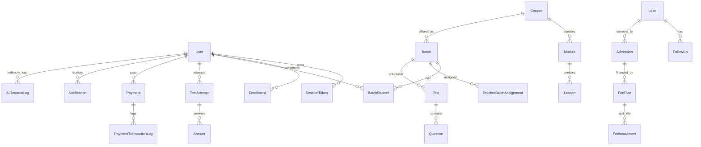

# 07 - Data Model Audit

## Schema Inventory

Confirmed Prisma schema:

- File: `backend/prisma/schema.prisma`
- Models: 191
- Enums: 9
- Index/unique declarations: 617

The schema is broad and covers most of the intended Academy OS domains.

## Major Model Groups

### Identity and Access

- `User`
- `SessionToken`
- `PasswordReset`
- `ParentStudentInvitation`
- `ParentStudentLink`
- `Otp`
- `AdminRole`
- `Permission`
- `RolePermission`
- `UserRole`
- `RoleActivity`
- `AuditLog`

Purpose: authentication, sessions, parent linking, custom admin permissions, activity and auditing.

### Academic/LMS

- `Course`
- `Module`
- `Lesson`
- `Enrollment`
- `Batch`
- `BatchStudent`
- `TeacherBatchAssignment`
- `Attendance`
- `Timetable`
- `LiveClass`
- `RecordedLecture`
- `LectureProgress`
- `LecturePlaybackEvent`
- `StudyPlan`
- `RevisionSchedule`
- `RevisionQueueItem`
- `LearningAnalyticsSnapshot`
- `LearningTopicInsight`

Purpose: course hierarchy, batch allocation, timetable, attendance, recorded/live learning, revision and analytics.

### Exams and Assessments

- `Test`
- `Question`
- `QuestionBankItem`
- `TestAttempt`
- `CBTAnswerState`
- `CBTIntegrityEvent`
- `Answer`
- `AssessmentArenaAssessment`
- `AssessmentQuestion`
- `AssessmentAttempt`
- `AssessmentAnswer`
- many assessment trait/dimension/risk/readiness/top-rank/SSB models
- `PsychometricTest`
- `PsychometricQuestion`
- `PsychometricAttempt`
- `PsychometricReport`
- `PsychometricAnswer`

Purpose: test engine, CBT attempts, question bank, integrity, psychometrics, SSB/top-rank intelligence.

### Admissions and CRM

- `Lead`
- `FollowUp`
- `Admission`
- `CounsellingBooking`
- `Referral`
- `ApprovalRequest`
- `ScholarshipDiscount`

Purpose: lead management, admission journey, counselling, approval, referrals, scholarships.

### Finance

- `Payment`
- `Subscription`
- `FeeInstallment`
- `Invoice`
- `FeePlan`
- `PaymentTransactionLog`
- `FinanceDocument`
- `DirectorExpenseRecord`
- `Payroll`

Purpose: online/manual payments, installments, receipts/invoices, subscriptions, expenses, payroll.

### Communication

- `Notification`
- `MessageThread`
- `Message`
- `EmailLog`
- `PushNotification`

Purpose: in-app, email, push, and internal messaging.

### AI

- `AIInterviewSession`
- `AIInterviewQuestion`
- `DoubtQuery`
- `AIRecommendation`
- `AITutorSession`
- `AITutorMessage`
- `AITutorFeedback`
- `AIResponseCache`
- `AIRequestLog`
- `AiWorkflowRequest`
- `AiWorkflowContext`
- `AiWorkflowDraft`
- `AiWorkflowReview`
- `AiWorkflowApproval`
- `AiWorkflowFeedback`
- `AiWorkflowPublication`
- `AiWorkflowAuditEvent`

Purpose: AI interactions, AI cache/logging, workflow drafts, approvals, publications, audit trail.

### Operations

- `Faculty`
- `Classroom`
- `Hostel`
- `Room`
- `HostelAllocation`
- `InOutEntry`
- `HostelLeave`
- `MessMenu`
- `DisciplineRecord`
- `ParadePerformance`
- `FitnessProfile`
- `PTSchedule`
- `PTAttendance`
- `PhysicalEligibility`
- `DailyFitnessLog`
- `MediaFolder`
- `MediaFile`
- `Document`
- `Branch`
- `Institute`

Purpose: people/resources/hostel/media/fitness/branch administration.

## Relationship Diagram

## Strengths

- Domain breadth is excellent.
- Many high-volume fields are indexed.
- Composite uniques exist for common joins such as enrollment, batch student, teacher assignment, attempt-question.
- AI, assessment, and finance logs exist.
- Branch and institute models exist for future scale.

## Risks

- Many status fields are strings instead of enums, which can create inconsistent states.
- Multi-tenant safety is incomplete until every query consistently scopes by institute/branch.
- Some academic planner data appears stored in JSON-like schedule fields rather than normalized planner models.
- Model count is high; ownership and lifecycle rules should be documented before major changes.
- Generated Prisma code is checked into backend source, which increases repository noise and search cost.

## Future Suitability

The schema is future-suitable if NIDUS chooses gradual modernization. It is too valuable to discard, but it needs data ownership, status normalization, migration governance, tenant scoping, and workflow-event discipline.

