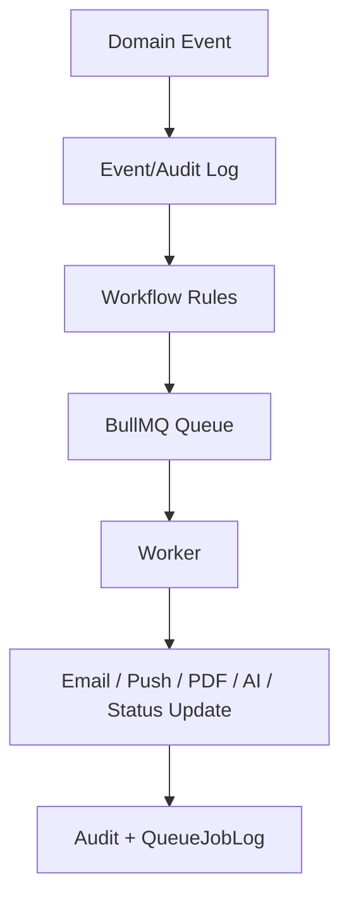

# 08 - Automation Audit

## Confirmed Automation Infrastructure

Backend queues live under `backend/src/queues`:

- `queue.config.ts`
- `index.ts`
- `email.queue.ts`
- `notification.queue.ts`
- `pdf.queue.ts`
- `ai.queue.ts`
- `scheduler.queue.ts`

BullMQ and Redis are used when available. Queue names include:

- `nidus.email`
- `nidus.ai`
- `nidus.pdf`
- `nidus.notifications`
- `nidus.scheduled`
- `nidus.daily-intelligence`
- `nidus.analytics`

## Worker Startup

`backend/src/server.ts` starts infrastructure workers unless `PROCESS_ROLE` is `web`. `backend/src/queues/index.ts` starts email, AI, PDF, notification, scheduled, and daily intelligence workers when enabled and Redis is available.

## Recurring Jobs

`scheduler.queue.ts` schedules:

- Session cleanup every 30 minutes.
- Daily intelligence shell at 5:00.
- Daily analytics at 2:15.

## Automation Persistence

`QueueJobLog` model records queue job name, id, status, attempts, payload, error, and timestamps.

## Current Automation Examples

- Payment success queues PDF receipt generation.
- Payment success queues notification.
- Email queue sends Resend email jobs.
- Notification queue sends Firebase push.
- AI queue records AI queued task.
- Scheduler creates recurring shells.
- Production/readiness scripts verify queue availability.

## Proposed Event Automation Direction

## Strengths

- Queue infrastructure exists.
- Redis is optional unless required.
- Queue failures are logged.
- PDF, email, AI, notification, scheduler workers are separated.
- Readiness scripts exist.

## Risks

- Workflow automation is not yet centralized around domain events.
- Recurring jobs are shells and need confirmed business implementations.
- Queue fallback skips jobs when Redis is unavailable; acceptable for optional features, risky for financial/admission-critical automations.
- Idempotency rules are not visible as a shared framework.

## Future Suitability

The queue foundation is reusable. NIDUS should add declarative workflow rules around existing queues instead of creating another automation engine.

