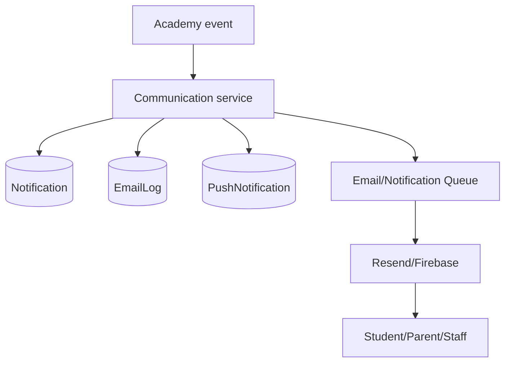

# 09 - Communication Audit

## Confirmed Communication Channels

Backend modules:

- `backend/src/modules/communication`
- `backend/src/services/email.service.ts`
- `backend/src/queues/email.queue.ts`
- `backend/src/queues/notification.queue.ts`

Prisma models:

- `Notification`
- `MessageThread`
- `Message`
- `EmailLog`
- `PushNotification`

Integrations:

- Resend email via `RESEND_API_KEY`
- Firebase push via Firebase env variables
- Sales Booster WhatsApp via `SALESBOOSTER_WHATSAPP_*`
- Public WhatsApp handoff links in frontend join/start flows

## API Routes

Mounted routes:

- `/api/notifications`
- `/api/messages`
- `/api/announcements`
- `/api/emails`
- `/api/push`

Communication routes include:

- Get notifications
- Mark notification read
- Message threads
- Send messages
- Announcements
- Email logs
- Send email
- Send push

## Communication Workflow

## Strengths

- Multi-channel primitives exist.
- Email fallback behavior exists when Resend is not configured in non-production.
- In-app notification model exists.
- Push queue exists.
- Messages and announcements are separate concepts.
- Communication routes are protected except public lead forms.

## Gaps

- No confirmed global message preference model.
- No confirmed WhatsApp opt-in/opt-out governance model.
- No confirmed cost-control policy for WhatsApp message frequency.
- No confirmed summary bundling service for daily/weekly parent updates.
- No confirmed template approval lifecycle outside sales booster settings.
- No confirmed communication audit that links each message to a domain event.

## Future Suitability

Existing communication models should be reused. The missing product is not another inbox; it is a communication policy layer that decides when to use in-app, email, WhatsApp, or push, and when to combine messages into summaries.

