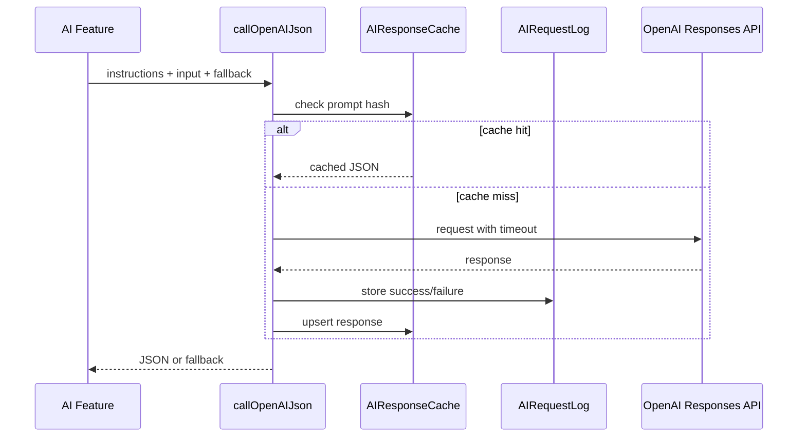
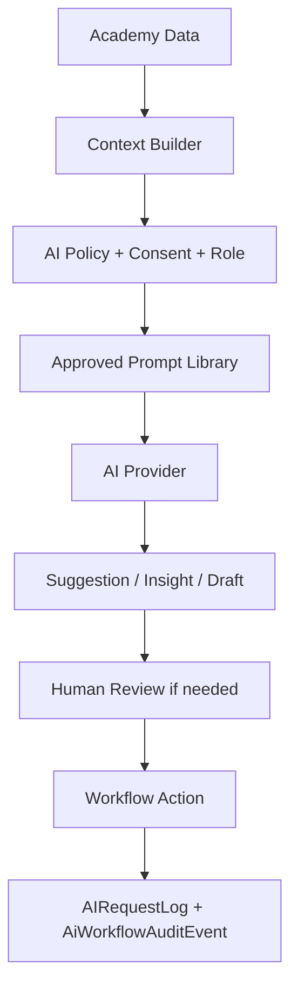

# 10 - AI Readiness

## Confirmed AI Modules

Backend:

- `ai-engine`
- `ai-exam`
- `ai-planner`
- `ai-workflow`
- `learning-stability`
- `psychometric-ai`
- `fitness-ai`
- `sales-booster-ai`

Frontend:

- `ai-engine`
- `ai-planner`
- `nidus-ai`
- AI pages such as doubt solver, interview, study planner, recommendations

Database:

- AI interview/session/question models
- AI tutor models
- AI recommendation models
- `AIResponseCache`
- `AIRequestLog`
- AI workflow request/context/draft/review/approval/publication/audit models

## OpenAI Integration

`backend/src/modules/ai-engine/openai.service.ts` confirms:

- Model: `gpt-4.1-mini`
- Endpoint: OpenAI Responses API
- JSON call wrapper
- Prompt hashing
- Six-hour response cache
- AI request logging
- Timeout via `AbortController`
- Fallback response when API fails
- Production requires `OPENAI_API_KEY` for AI features

## AI Flow

## AI Product Coverage

Confirmed or indicated:

- AI interview questions and answer analysis.
- Doubt solving.
- Recommendations.
- Officer potential.
- AI study planner.
- AI exam draft generation.
- Learning stability/current affairs/content generation.
- Sales booster campaign drafting.
- AI workflow draft/review/approval models.

## Strengths

- AI is not only frontend decoration; backend models and services exist.
- Cache and request logs exist.
- Fallbacks exist for failed AI calls.
- AI workflow approval models are future-ready.
- Prompt centralization exists in `ai-prompts.ts` for AI engine.

## Risks

- AI is still exposed as multiple modules/pages rather than one invisible operating layer.
- Prompt governance is partial; different modules may have separate prompt patterns.
- Cost controls beyond caching are not fully visible.
- AI quality monitoring and human approval are only partly visible.
- AI may currently assist features more than it monitors academy operations.

## Future AI Orchestration

## Recommendation

Reuse all existing AI modules. Create a unified AI Operating Layer that quietly feeds cards, recommendations, summaries, alerts, drafts, and reviews inside each role workflow.

