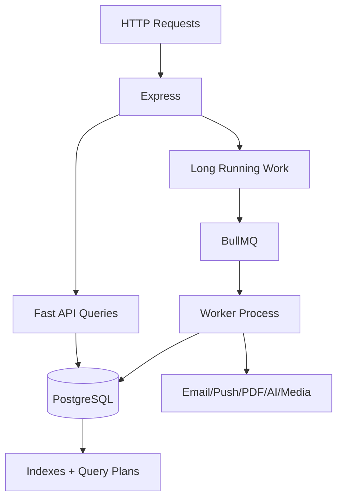

# 12 - Performance and Scalability

## Current Performance Foundation

Confirmed:

- Next.js compression and image format settings.
- Backend compression.
- PostgreSQL with many indexes.
- Redis optional for rate limiting and queues.
- AI response cache.
- Axios timeout.
- API health endpoints.
- Queue workers for background tasks.
- PDF generation offloaded to worker.
- Cloudinary for media storage.

## Scale-Sensitive Surfaces

High-risk surfaces:

- Director dashboard and reports.
- Teacher dashboard/client.
- Assessment arena and CBT attempts.
- Question bank listing/search.
- Payments history and analytics.
- CRM lead bulk upload/listing.
- Academic planner calendar generation.
- Media library.
- Communication logs.
- AI request/cache/log tables.

## Query Risks

Static inspection confirms many indexed fields, but large-system risks remain:

- Some list endpoints may lack consistent pagination.
- Dashboard services likely aggregate many tables per request.
- Large JSON planner/status fields may become hard to query.
- Generated reports and analytics may need materialized snapshots.
- Object-level branch scoping will require composite indexes when multi-branch is active.

## Frontend Risks

- 238 route pages increase bundle and maintenance surface.
- Large dashboard components can cause unnecessary re-renders.
- Recharts and media-heavy pages should be lazy-loaded where appropriate.
- Public landing should avoid large cinematic bundles unless intentionally loaded.

## Backend Scalability Diagram

## Scalability Readiness

Good:

- Queue split supports web/worker separation.
- Redis optional mode reduces startup fragility.
- DB readiness and queue readiness scripts exist.
- Sentry hooks exist.

Needs validation:

- Load tests for dashboard/report endpoints.
- CBT concurrency tests.
- Bulk lead upload limits under production DB.
- Payment webhook idempotency under retries.
- Upload concurrency and memory use.
- AI timeout/cost/rate behavior.

## Verdict

The system can scale with tuning. It should not be scaled blindly. Add performance budgets, pagination contracts, query tracing, and role-dashboard response targets before multi-branch growth.

