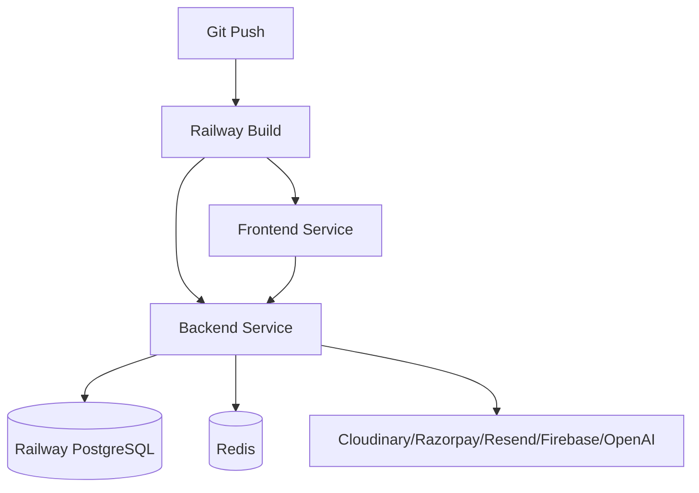

# 13 - Reliability and Operations

## Production Readiness Assets

Confirmed files:

- `PRODUCTION_CHECKLIST.md`
- `PRODUCTION_GO_LIVE.md`
- `DEPLOYMENT.md`
- `docs/OPERATIONAL_HANDBOOK.md`
- `docs/BACKUP_RECOVERY.md`
- `docs/RAILWAY_SETUP.md`
- `scripts/validate-production-env.mjs`
- backend readiness scripts for database, queue, integrations, security, auth, infra, CBT, payments, AI, ops

## Health and Runtime State

`/api/health` returns service status, timestamp, uptime, environment, DB runtime readiness, Redis configured/optional status, and runtime phase from `backend/src/runtime/lifecycle.ts`.

Runtime phases:

- `BOOTING`
- `READY`
- `DEGRADED`
- `SHUTTING_DOWN`

## Deployment Model

Deployment docs describe Railway services:

- Backend service with Prisma migration deploy and health check.
- Frontend service with Next build/start.
- Railway PostgreSQL.
- Optional/required Redis based on env.

## Reliability Strengths

- Health checks.
- Maintenance mode.
- Graceful worker close functions.
- Queue job logs.
- Audit logs.
- Sentry configuration.
- Backup scripts/documentation.
- Production smoke scripts.
- Redis optional fallback improvements.

## Reliability Risks

- Queue jobs can be skipped if Redis is unavailable and optional; business-critical jobs need priority and retry guarantees.
- Some backup scripts appear instructional shells rather than complete automated backups.
- Provider outages need user-facing fallback states.
- Webhook idempotency should be verified with real retry scenarios.
- Logs need PII masking review.
- Generated Prisma files in source can obscure audits and increase repository size/noise.

## Operational Recommendation

Before major growth:

1. Establish staging with production-like DB/Redis/providers.
2. Run full readiness suite before every release.
3. Add uptime and queue dashboards.
4. Classify queues as critical vs best-effort.
5. Add rollback playbooks with tested DB backup/restore.

