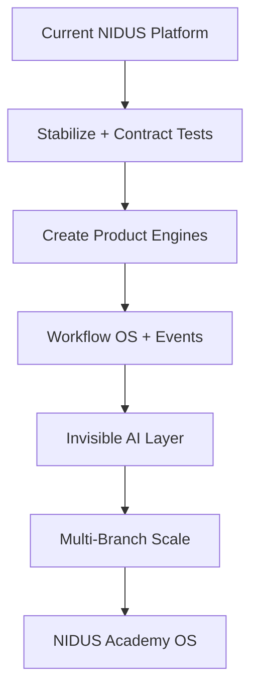

# 18 - Build vs Modify Decision

## Options Compared

### Option 1: Improve Current Application

Pros:

- Lowest immediate risk.
- Preserves production workflows.
- Uses existing schema, APIs, and pages.

Cons:

- May not solve deep complexity.
- Navigation and workflow duplication can remain.
- AI/automation may remain fragmented.

Verdict: Good for short-term stabilization, insufficient alone.

### Option 2: Gradual Modernization / Partial Rebuild

Pros:

- Preserves existing data and business logic.
- Allows better UX and operating engines.
- Reduces risk through phased migration.
- Lets the academy keep using the platform.

Cons:

- Requires strong architecture governance.
- Needs discipline to avoid duplicate modules.
- Takes longer than cosmetic fixes.

Verdict: Best path.

### Option 3: Full New Build and Migration

Pros:

- Clean architecture from day one.
- Opportunity for perfect design and flows.

Cons:

- Very high migration risk.
- Rebuilds 191 models and many workflows.
- Payment, admission, exam, and student history migration would be dangerous.
- Existing integration investment is discarded.

Verdict: Not recommended unless production system is unusable or data model is proven unsalvageable.

## Final Decision

Choose **Option 2**.

## Decision Rationale

The system already has too much useful domain depth to throw away. But it also has too much complexity to simply polish. Partial modernization gives the highest probability of reaching an enterprise-grade Academy OS.

