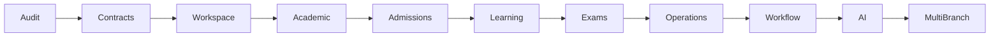

# 19 - Recommended Roadmap

## Phase 0 - Freeze and Protect

- Freeze schema changes except critical fixes.
- Add route/API inventory.
- Add RBAC contract tests.
- Add staging environment parity.
- Verify production env and secrets.

## Phase 1 - Stabilize Platform

- Validate build, TypeScript, lint, Prisma.
- Audit runtime logs.
- Classify queues.
- Verify Redis optional/required behavior.
- Verify payment webhooks and backups.

## Phase 2 - Role Workspace Simplification

- Keep all routes.
- Simplify visible menus.
- Make dashboards answer "what should I do today?"
- Hide complexity through role workspaces.

## Phase 3 - Academic Engine

- Define one Academic Planner source of truth.
- Connect program -> batch -> timetable -> class -> attendance -> completion -> material -> homework -> quiz -> test.
- Preserve existing academy APIs.

## Phase 4 - Admission Journey

- Connect lead -> counselling -> application -> documents -> approval -> fee -> batch -> activation.
- Use existing CRM, payments, academy approval.

## Phase 5 - Learning Engine

- Unify course, learning hub, live classes, recorded lectures, materials, assignments, progress.
- Keep existing models.

## Phase 6 - Examination Engine

- Unify tests, CBT, question bank, assessment arena, AI exam, reports.
- Keep scoring/attempt logic stable.

## Phase 7 - Operations OS

- Consolidate finance, accounts, HR, admin resources.
- Keep payment and payroll calculations stable.

## Phase 8 - Workflow OS

- Introduce domain events.
- Orchestrate notifications, queues, approvals, reminders.
- Add idempotency rules.

## Phase 9 - AI Operating Layer

- AI suggestions inside workflows.
- AI risk alerts for Director/Academic Head.
- AI summaries for parents/students.
- Human approval where needed.

## Phase 10 - Multi-Branch Readiness

- Enforce institute/branch scoping.
- Add branch-aware reporting.
- Add data partition/index review.

## Migration Sequence

## First 30 Days

1. Build route and API inventory script.
2. Add RBAC endpoint matrix tests.
3. Add object ownership tests for student, parent, teacher, finance, branch.
4. Establish staging release checklist.
5. Define event names for top 20 workflows.
6. Document module ownership.
7. Measure dashboard API timings.
8. Review all public forms for spam/rate limits.
9. Verify backup/restore.
10. Align README/env docs with current providers.

