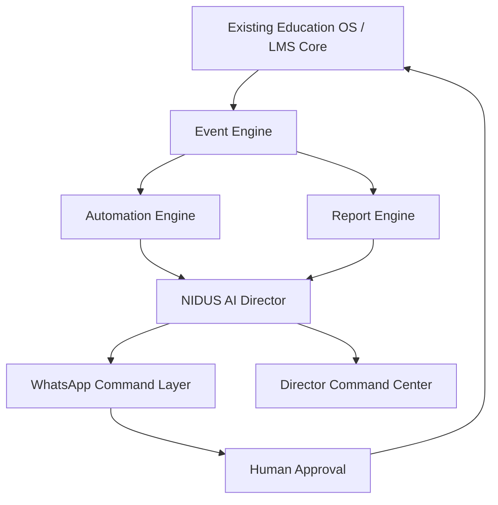

# 21 - Phase 01 Product Lock

## Status

Phase 01 is now locked as the product and architecture direction for the launch build.

This phase does not add new application features. It defines the non-negotiable operating model that every later build phase must follow.

## Locked Product Decision

NIDUS Academy OS will not be rebuilt from zero.

The current Education OS/LMS remains the **system of record**.

NIDUS will be transformed by building a new operating layer on top of the existing platform:

1. Event Engine
2. Automation Engine
3. NIDUS AI Director
4. WhatsApp Command Layer
5. Director Command Center
6. Simple role dashboards

## System of Record

The existing platform remains responsible for:

- Users
- Roles
- Authentication
- Student records
- Parent records
- Teacher records
- Staff records
- Courses
- Batches
- Timetable
- Attendance
- Admissions
- Leads
- Fees
- Payments
- Exams
- Question bank
- Learning records
- Notifications
- Audit logs
- AI request logs
- Media records
- Documents

These should not be rebuilt unless a future technical phase proves that a specific part is unsafe or unusable.

## Operating Layer to Build

The new launch focus is:

## NIDUS AI Director Definition

NIDUS AI is the AI Operations Director of NIDUS Defence Academy.

It is responsible for monitoring, summarizing, recommending, reminding, escalating, and reporting across:

- Admissions
- Telecalling
- Counselling
- Applications
- Fee collection
- Batch allocation
- Academics
- Timetable
- Class completion
- Attendance
- Teacher performance
- Student progress
- Parent communication
- HR
- Staff performance
- Exams
- Assignments
- Leaderboards
- Reports

NIDUS AI does not replace humans.

NIDUS AI ensures humans do their work on time.

## Director Operating Principle

The Director should not receive every small notification.

The system must reduce information, not increase it.

Escalation principle:

1. Notify the responsible person first.
2. Notify the department head if unresolved.
3. Notify the Director only if the issue remains unresolved or has business risk.

Example:

- Teacher 5 minutes late: no Director message.
- Teacher 15 minutes late: notify Academic Head.
- Still unresolved after 10 more minutes: notify Director.

## WhatsApp Product Lock

WhatsApp is the Director control layer.

The web app remains the detailed work system.

Director should manage 80-90% of daily supervision through WhatsApp:

- Morning report
- Midday report
- Evening report
- Weekly report
- Monthly report
- Urgent exception alerts
- Approval commands
- Drill-down replies
- AI questions

The Director must be able to reply with simple commands:

- `1`
- `2`
- `APPROVE`
- `REPORT`
- `ISSUES`
- `TOMORROW`
- `FEES`
- `ADMISSIONS`
- `ACADEMICS`

## Web App Product Lock

The web app should be used for detailed work that is not suitable for WhatsApp:

- Timetable creation
- Curriculum setup
- Batch setup
- Question-bank management
- Fee configuration
- Employee onboarding
- Bulk admission import
- Detailed reports
- Permissions
- Academy configuration

## Dashboard UX Rule

All dashboards must follow this rule:

> Clean grid style, less content, fewer options, simple English, large clear actions, non-messy layout, and rural-area-friendly user experience.

Every dashboard must answer:

> What should I do today?

Every dashboard must avoid:

- Too many menu options
- Dense ERP tables as first screen
- Technical labels
- Long paragraphs
- Small buttons
- Hidden critical actions
- Decorative clutter
- Complex filters as primary UI
- Duplicate cards
- Repeated modules

## Dashboard Structure Lock

Every dashboard should use this structure:

1. Today summary
2. Needs attention
3. Pending actions
4. Important numbers
5. Simple next actions
6. Recent updates

Maximum visible action cards per dashboard: 6.

Maximum priority alerts per dashboard: 3.

## Role Experience Lock

### Director

Primary experience:

- WhatsApp reports
- Director command center
- Academy health
- Exceptions
- Approvals
- Daily/weekly/monthly reports

### Academic Head

Primary experience:

- Today's classes
- Delayed classes
- Teacher attendance
- Planner progress
- Pending reviews
- Weak batches

### Teacher

Primary experience:

- Today's classes
- Mark attendance
- Complete class
- Upload material
- Assign homework
- Conduct daily exam
- See student feedback

### Student

Primary experience:

- Today's learning
- Daily exam
- Assignment before night
- Progress
- Leaderboard
- Weak topics

### Parent

Primary experience:

- Child attendance
- Homework completion
- Exam performance
- Fee status
- Weekly summary

### Admission Cell

Primary experience:

- Today's leads
- Follow-ups due
- Counselling
- Applications
- Documents
- Admission activation

### Accounts

Primary experience:

- Today's collection
- Pending fees
- Payment links
- Receipts
- Fee follow-ups

### HR/Admin

Primary experience:

- Staff attendance
- Hiring
- Onboarding
- Training
- Leave
- Performance

## Phase 01 Completion Criteria

Phase 01 is complete when:

- Product direction is documented.
- Rebuild decision is locked.
- Existing system-of-record decision is locked.
- NIDUS AI Director concept is locked.
- WhatsApp-first operating layer is locked.
- Dashboard UX rule is locked.
- Role experience principles are locked.
- Future phases have a clear decision gate.

## Future Phase Gate

No future phase should be approved unless it satisfies:

1. It reuses the current core wherever safe.
2. It does not create duplicate systems.
3. It simplifies the user experience.
4. It supports WhatsApp + automation direction.
5. It follows the dashboard UX rule.
6. It preserves existing routes and data unless explicitly approved.
7. It improves launch readiness.

## Phase 01 Verdict

Phase 01 is complete.

NIDUS is now locked as:

**Existing Education OS core + WhatsApp-first AI Operations Layer + simple rural-friendly dashboards.**

